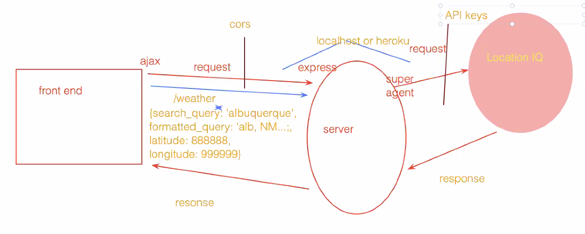

# lab-06
# Project Name

**Author**: Chris Hamersly
**Version**: 1.0.4 (increment the patch/fix version number if you make more commits past your first submission)

## Overview
This app is collecting data from a search query and producing results.

## Getting Started
A user must be able to set up a server from their computer to run from their machine. 

## Architecture
This is made using .JSON, .ENV, and Javascript

## Change Log
4.30pm, got the locations and the weather with the time to correctly render to the page. 

6.30pm finally got the database to hook up to the site.
## Credits and Collaborations
Worked with Michael Revfem to get this application to work. 

Number and name of feature: Feature 1 & 2 

Estimate of time needed to complete: six hours

Start time: 13.00pm

Finish time: 17.30

Actual time needed to complete: 2.5 hours

# Lab 08

Number and name of feature: Getting information to populate SQL

Estimate of time needed to complete: 4 hours

Start time: 13.00

Finish time: 17.00

Actual time needed to complete: 2 hourse

***

Number and name of feature: Connecting Database to Heroku

Estimate of time needed to complete: 30 minutes

Start time: 19.00

Finish time: 21.00

Actual time needed to complete: 2 hourse

